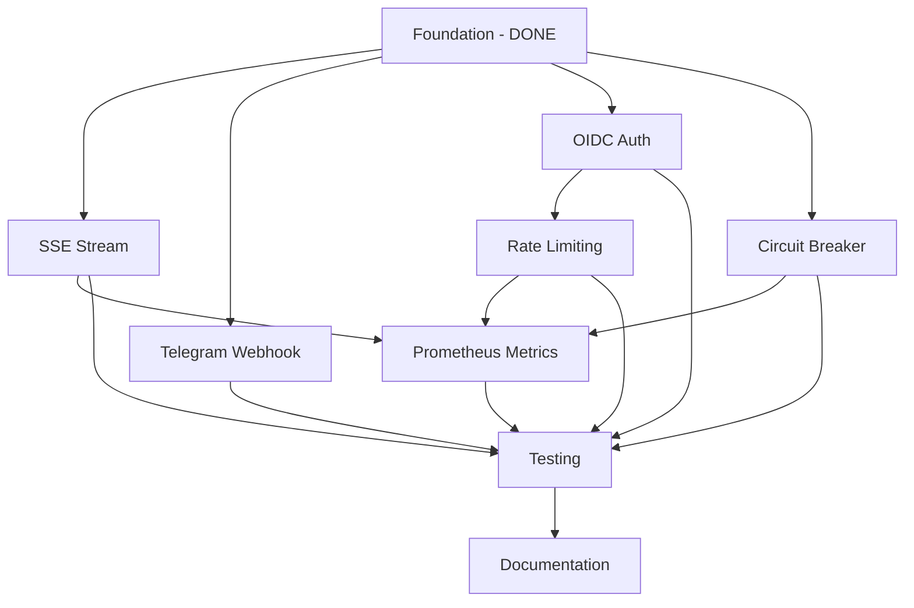

# Commit Plan for Issue #2: Phoenix Edge Gateway

## Current Status
✅ **Commit 1** - Foundation (COMPLETED)
```
feat: Phoenix Edge Gateway foundation and project structure fix
- Basic Phoenix setup with router and endpoint
- POST /v1/generate endpoint (working)
- Placeholder controllers and plugs
- Fixed project structure (moved from scripts/test to root)
```

## Remaining Commits

### 🔄 **Commit 2** - SSE Event Stream
```
feat: Implement GET /v1/events SSE stream
- Create EventsController with SSE support
- Implement Phoenix.Channel for real-time events
- Connect to AMQP event streams from VSM systems
- Add event filtering by tenant/type
- Test with curl/EventSource client
```

### 🔄 **Commit 3** - Telegram Webhook Integration
```
feat: Add POST /telegram/webhook forwarding
- Create TelegramController
- Validate webhook signatures
- Forward messages to S1 TelegramAgent via AMQP
- Handle callback queries and inline keyboards
- Add webhook registration helper
```

### 🔄 **Commit 4** - OIDC Authentication
```
feat: Complete OIDC authentication integration
- Implement full OIDC plug with JWT validation
- Add tenant extraction from JWT claims
- Configure OIDC provider settings
- Add refresh token handling
- Integrate with AuthManager
```

### 🔄 **Commit 5** - Circuit Breaker Implementation
```
feat: Implement adaptive circuit breaker patterns
- Complete CircuitBreaker plug
- Integrate with existing AdaptiveCircuitBreaker
- Add per-endpoint circuit breaker configuration
- Implement half-open state logic
- Add telemetry events for monitoring
```

### 🔄 **Commit 6** - Rate Limiting Enhancement
```
feat: Enhance rate limiting with per-tenant quotas
- Extend RateLimiter plug with tenant awareness
- Add sliding window rate limiting
- Implement quota management
- Add rate limit headers to responses
- Store limits in Redis/CRDT
```

### 🔄 **Commit 7** - Prometheus Metrics
```
feat: Add Prometheus metrics endpoint
- Create MetricsController
- Expose /metrics endpoint
- Add custom metrics for:
  - Request latency by endpoint
  - Rate limit violations
  - Circuit breaker trips
  - SSE connection count
  - Tenant usage statistics
```

### 🔄 **Commit 8** - Testing Suite
```
test: Add comprehensive tests for Edge Gateway
- Unit tests for all controllers
- Integration tests for auth flow
- Load tests for rate limiting
- Circuit breaker behavior tests
- SSE connection tests
- Telegram webhook tests
```

### 🔄 **Commit 9** - Documentation
```
docs: Complete Edge Gateway documentation
- API documentation with examples
- Configuration guide
- Deployment instructions
- Security best practices
- Monitoring setup guide
```

## Execution Order & Dependencies



## Time Estimates
- SSE Stream: 2-3 hours
- Telegram Webhook: 1-2 hours
- OIDC Auth: 3-4 hours
- Circuit Breaker: 2 hours
- Rate Limiting: 2 hours
- Prometheus Metrics: 1-2 hours
- Testing: 3-4 hours
- Documentation: 1-2 hours

**Total: ~15-22 hours of work**

## Branch Strategy
- Work on `feat/phoenix-edge-gateway` branch
- Make atomic commits for each feature
- Push after each commit for CI/CD feedback
- Squash merge to main when complete

## Success Criteria (from Issue #2)
- [ ] POST /v1/generate endpoint operational ✅
- [ ] GET /v1/events SSE stream working
- [ ] POST /telegram/webhook forwarding active
- [ ] OIDC authentication integrated
- [ ] Per-tenant rate limiting enforced
- [ ] Circuit breaker patterns implemented
- [ ] TLS 1.3 enforced ✅
- [ ] Prometheus metrics exposed